## Startpunt

In het verleden heb ik meerdere portfolio-websites gemaakt, maar geen enkele daarvan heeft de tand des tijds echt doorstaan. Voor dit project wilde ik iets bouwen waar ik echt trots op kon zijn. Daarom heb ik een ouder portfolio-concept, genaamd Collage, als startpunt gebruikt en dit verder ontwikkeld tot een volledig vernieuwde website.

Zie hier de bijbehorende GitHub repository → https://github.com/bijldavid/collage

Het idee van de beginpagina vond ik nog steeds sterk. Deze doorbreekt de standaard lange onepage website die je vaak ziet bij portfolio websites. In plaats daarvan kan de gebruiker direct kiezen uit drie navigatie items: Projects, CV of About. Daarom heb ik dit concept en de bestaande 3D assets hergebruikt.

Over het ontwerp van de oude projectgallerij was ik minder tevreden. Voor dat onderdeel ben ik daarom een andere richting ingeslagen. Daarnaast was de vorige versie gemaakt met native HTML, CSS en JavaScript. Voor de vernieuwde versie heb ik gebruikgemaakt van Nuxt en Vue. Bij een groter project zoals dit biedt een framework meer structuur. Bovendien biedt een framework toegang tot components en slimme loops, waardoor ik dubbele code kan voorkomen.

Kortom: ik heb de sterke elementen uit het bestaande concept hergebruikt en de rest van het portfolio voorzien van een vernieuwde vormgeving en een betere technische structuur.

## Homepage

Voor de homepage had ik bepaalde assets al gemaakt, met name de 3D creaties voor Projects, CV en About. In het oude ontwerp verschoof de achtergrond tijdens de `:hover` state en verscheen er een ondertitel. Dit heb ik aangepast, omdat ik het achteraf een beetje too much vond. Het nieuwe ontwerp mocht wat simpeler en robuuster worden.

Bij het oude ontwerp waren de navigatie-items ook een stuk groter. Het nieuwe ontwerp is smaller en oogt daardoor wat rustiger. Hoewel ik het verschuiven van de achtergrond gaaf vond, zorgde het voor complicaties op erg brede schermen. Uiteindelijk heb ik ervoor gekozen dit achterwege te laten. In plaats van een opvallend grid gebruik ik nu een minder aanwezig gestreept patroon als achtergrond.

Verder heb ik de ondertitels veranderd in labels die qua stijl beter aansluiten bij de rest van de website. Wat ik zelf cool vind aan deze labels, is de shine animatie. Deze is gemaakt met een `linear-gradient`, waarvan de `background-position` wordt geanimeerd:

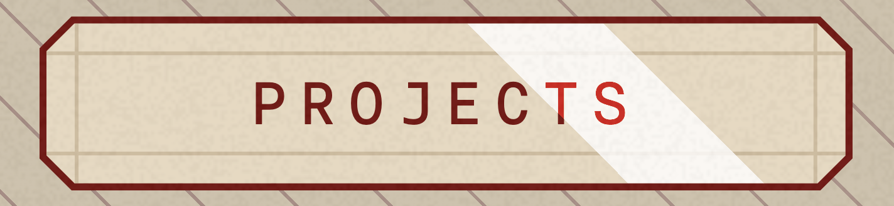

```css
.index ul li .label::after {
    content: '';
    position: absolute;
    inset: 0;
    background: linear-gradient(
        45deg,
        transparent 45%,
        #fff 45%,
        #fff 55%,
        transparent 55%
    );
    background-size: 150% 100%;
    animation: shine 2s linear infinite;
    opacity: .8;
    mix-blend-mode: overlay;
}

@keyframes shine {
    0% {
        background-position: 150% 0;
    }

    100% {
        background-position: -150% 0;
    }
}
```

## Projectgalerij

Ook voor de projectgalerij had ik al een begin van een pagina gemaakt. In tegenstelling tot de homepage was ik met de oude versie hiervan niet zo tevreden. In plaats van bestaande elementen te hergebruiken en te verbeteren, koos ik ervoor om voor deze pagina volledig opnieuw te beginnen.

Ik vond het belangrijk om bovenaan de pagina een kort inleidend stukje te plaatsen. Daarnaast geef ik alle projecten weer in een lijst aan de linkerkant. Deze items zijn via anchor links gekoppeld aan de bijbehorende projectkaarten. 

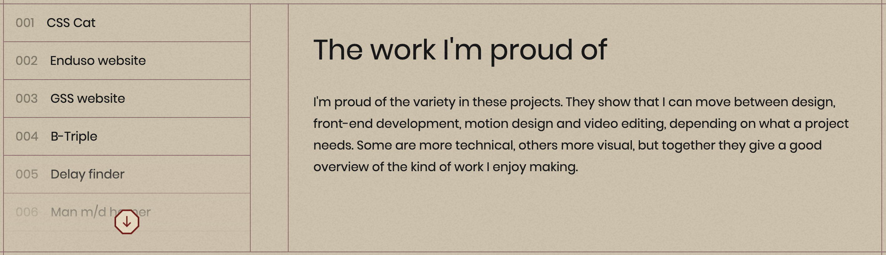

Zodra de gebruiker op een project klikt, scrollt de pagina naar de juiste kaart. Vervolgens pas ik met CSS de styling van alle andere kaarten aan, zodat duidelijk wordt welke kaart actief is.

```css
/* :target styling */
.projects .container section:nth-of-type(2):has(li:target) > ul > li:not(li:target) > * {
    background: var(--background-solid);
    --line-color: var(--backdrop-400) !important;
}
```

Hier maak ik gebruik van de `:target` state. Deze styling wordt alleen toegepast wanneer de gebruiker vanuit het overzicht op een project heeft geklikt.

Om duidelijk te maken dat de lijst doorscrollbaar is, staat er een absoluut gepositioneerde `span` met een gradient overheen. Daarnaast staat er een button die heen en weer animeert. Wanneer de gebruiker op deze button klikt, scrollt de `ul` naar de onderkant van de lijst.

Een klein script houdt in de gaten of de lijst volledig naar beneden is gescrold. Wanneer dat het geval is, animeert de `span` naar een `opacity` van `0` en verdwijnt de button. Wanneer de onderkant nog niet is bereikt, blijven beide zichtbaar.

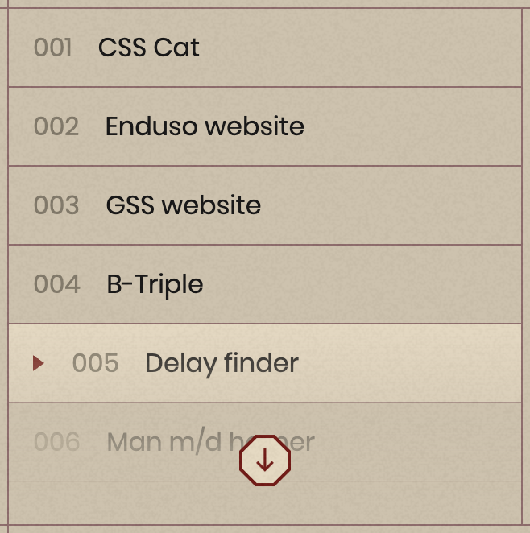

Verder kunnen de projecten worden gefilterd op drie categorieën: Code, Design en Video. Ieder project bestaat uit een object:

```js
// Voorbeeldobject
{
    id: 'project-1',
    slug: 'cssCat',
    title: 'CSS Cat',
    number: '001',
    image: '/images/css-cat.png',
    imageAlt: 'CSS Cat',
    description: 'A 3D Minecraft cat built and animated entirely with CSS.',
    tags: ['Design', 'Code'],
    projectLink: 'https://bijldavid.github.io/CSS-to-the-rescue/',
    projectGithub: 'https://github.com/bijldavid/CSS-to-the-rescue',
}
```

In dit object bepaal ik onder andere welke categorieën bij het project horen. De filteritems bestaan uit labels met daarin een `input` van het type `checkbox`:

```html
<!-- Filter labels -->
<fieldset class="vertical-lines">
    <legend class="visually-hidden">Project categories</legend>

    <label
        :class="getCategoryOrderClass('Design')"
        style="view-transition-name: category-design;"
    >
        <input
            :checked="selectedCategories.includes('Design')"
            type="checkbox"
            value="Design"
            @change="toggleCategory('Design')"
        >
        <span data-type="design">Design</span>
    </label>

    <label
        :class="getCategoryOrderClass('Code')"
        style="view-transition-name: category-code;"
    >
        <input
            :checked="selectedCategories.includes('Code')"
            type="checkbox"
            value="Code"
            @change="toggleCategory('Code')"
        >
        <span data-type="code">Code</span>
    </label>

    <label
        :class="getCategoryOrderClass('Video')"
        style="view-transition-name: category-video;"
    >
        <input
            :checked="selectedCategories.includes('Video')"
            type="checkbox"
            value="Video"
            @change="toggleCategory('Video')"
        >
        <span data-type="video">Video</span>
    </label>
</fieldset>
```

Hier maak ik gebruik van Vue directives en bindings om de JavaScript functionaliteit aan te sturen. Met `:checked` bind ik de `checked` property van de checkbox dynamisch aan de data in Vue. De dubbele punt is een shorthand voor `v-bind`. Met `@change` luister ik naar het `change` event van de checkbox. De @ is een shorthand voor `v-on`.

Wanneer de gebruiker een checkbox aan- of uitzet, wordt de functie `toggleCategory()` uitgevoerd en wordt de lijst met geselecteerde categorieën aangepast.

De volgorde van de filterlabels verandert afhankelijk van welke categorieën zijn geselecteerd. Bij een `:checked` state schuift het label naar links. Dit doe ik met de CSS property `order`.

De `order` property is niet interpolatable en animeert daarom niet automatisch tussen twee waardes. Om de beweging toch te animeren, maak ik gebruik van View Transitions.

De rest van de pagina bestaat uit de projectkaarten. Iedere kaart bevat:

- Een titel
- Een indexnummer
- Een afbeelding
- Categorielabels
- Een korte omschrijving
- Een button naar het bijbehorende project

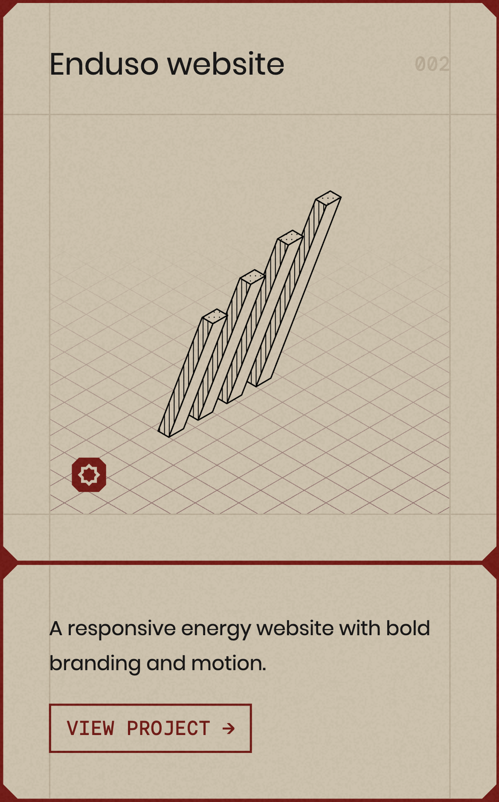

Een aantal coole implementaties licht ik hieronder verder toe.

### Responsive projectgrid

Voor de `ul` waarin alle projectkaarten staan, geldt de volgende regel:

```css
grid-template-columns: repeat(auto-fill, minmax(min(290px, 100%), 1fr)
);
```

Deze CSS-regel is volledig verantwoordelijk voor de responsiveness van het gehele grid.

### Animerende categorielabels

Ieder categorielabel heeft een passend icoontje. Tijdens de `:hover` state groeit het element in de breedte, waardoor de tekst van het label naast het icoontje zichtbaar wordt.

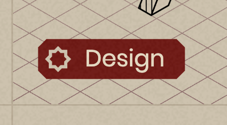

Hiervoor animeert het element bijvoorbeeld van een vaste breedte naar `max-content`. Aangezien `max-content` een intrinsic sizing keywords is, kan de browser hier niet naartoe interpoleren. Met de volgende property kan dit in ondersteunende browsers alsnog worden geanimeerd:

```css
interpolate-size: allow-keywords;
```

De browser kan hierdoor eerst de uiteindelijke grootte berekenen en vervolgens de animatie uitvoeren.

### Animerende buttontekst

Ook in de buttons zit een stukje moderne CSS verwerkt. Iedere button heeft een outline. Tijdens de `:hover` state vult de achtergrond zich van links naar rechts met een kleur. Tegelijkertijd verandert de tekstkleur van de button mee.

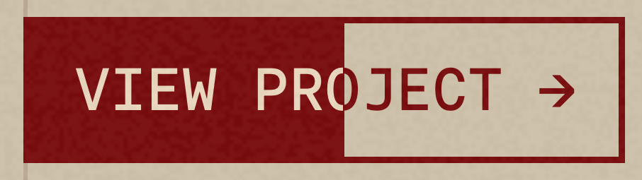

De truc is om de tekst te kleuren met de `background` property in plaats van met de standaard `color` property. Met een `background` zijn namelijk complexere dingen mogelijk.

```css
/* Tekst kleuren met de background property */
p {
    background-image: linear-gradient(
        90deg,
        red 50%,
        blue 50%
    );
    -webkit-background-clip: text;
    -webkit-text-fill-color: transparent;
}
```

Door vervolgens de positie van de gradient te vervangen door een custom property, kan deze waarde worden geanimeerd:

```css
@property --slide {
    syntax: "<percentage>";
    inherits: true;
    initial-value: 0%;
}

p {
    background-image: linear-gradient(
        90deg,
        red var(--slide),
        blue var(--slide)
    );

    -webkit-background-clip: text;
    -webkit-text-fill-color: transparent;
    transition: --slide 0.3s ease;
}

p:hover {
    --slide: 100%;
}
```


## Projectdetailpagina

Iedere projectdetailpagina volgt een vaste layout:

- Hero banner
- Breadcrumbs
- Titel en labels
- Briefing
- Introduction
- Project banner
- Process
- Final result

### Hero banner

De hero banner bestaat uit een isometrisch raster dat als `background-image` wordt gebruikt. De achtergrond heeft een `background-repeat-x: repeat` en blijft daardoor horizontaal oneindig herhalen.

Verder heeft ieder project een eigen isometrische afbeelding. Met behulp van View Transitions animeert deze afbeelding vanuit de projectkaart in de galerij naar de hero banner op de projectdetailpagina.

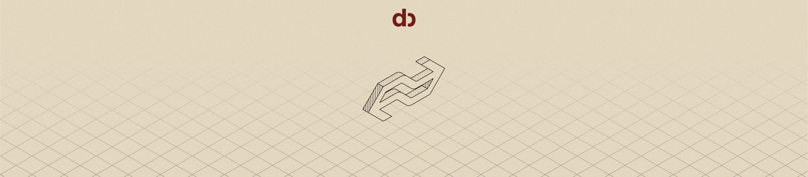

### Breadcrumbs

Om duidelijk te maken waar de gebruiker zich binnen de website bevindt, maak ik gebruik van breadcrumbs. Hiermee kan de gebruiker ook gemakkelijk terugnavigeren naar de homepage of de projectgalerij.

Ik vertel later meer over de breadcrumbs.

### Titel en labels

Iedere pagina, met uitzondering van de homepage, heeft een titelbalk met daarin de titel van de pagina. Dit is steeds de `<h1>`.

Op de projectdetailpagina’s gebruik ik deze ruimte daarnaast om de categorieën van het project weer te geven.

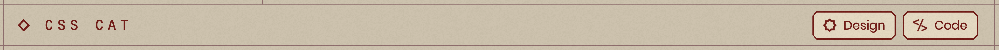

### Briefing

De briefing is een korte inleidende tekst waarin ik context geef over de opdracht en, wanneer dat van toepassing is, de opdrachtgever.

### Introduction

De introduction is een aanvulling op de briefing, maar richt zich meer op mijn persoonlijke rol, aanpak en doelen binnen het project.

### Project banner

Een grote lap tekst is natuurlijk niet altijd even interessant, zeker niet wanneer de tekst over een visueel project gaat. “Show, don’t tell” wordt ook wel eens gezegd.

Daarom staat er na de introduction een grote project banner. Hiermee geef ik de gebruiker direct een visuele indruk van het project, voordat ik dieper inga op het proces en de gemaakte keuzes.

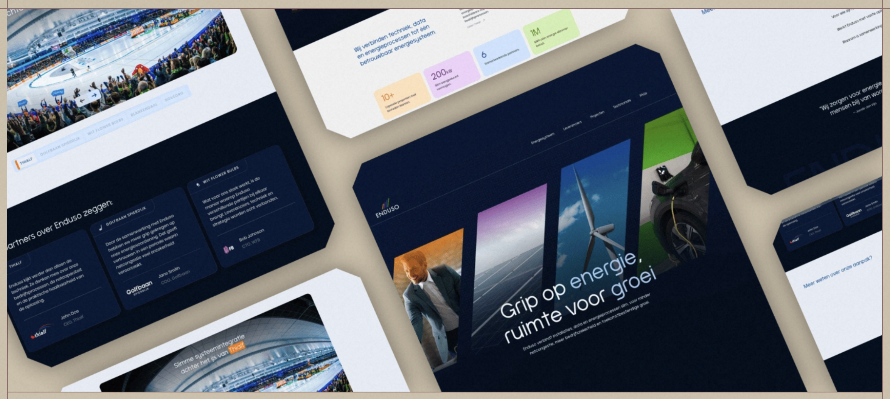

### Process

Binnen het onderdeel Process schrijf ik uitgebreider over het project en over interessante keuzes, uitdagingen en moeilijkheden waar ik tijdens het proces tegenaan liep.

Bij technischere projecten laat ik code snippets en codeblokken zien. Bij visuele projecten gebruik ik afbeeldingen en video’s om het verhaal te ondersteunen.

### Final result

Tot slot staat er een onderdeel voor het Final result. Hier geef ik een beknopte samenvatting van het eindresultaat en voeg ik soms een korte reflectie toe.

Verder kan de gebruiker vanuit dit onderdeel het project openen. Wanneer het om een technisch project gaat, kan de gebruiker ook de bijbehorende GitHub repository bezoeken.

## About me

Het eerste wat opvalt, is dat er nog geen foto van mijzelf op de About me-pagina staat. Ik ben van plan om binnenkort een goede foto te laten maken, dus daar wacht ik nog even op.

Verder bestaat deze pagina uit algemene informatie over mijzelf. Ik vertel onder andere wie ik ben, wat voor werk ik graag maak en hoe mijn interesse in webdesign en front-end development is ontstaan.

Daarnaast laat ik zien hoe ervaren ik mijzelf inschat met verschillende creative software en programmeertalen. Ook bevat de pagina een timeline van mijn werkervaring.

De meest benoemenswaardige onderdelen van deze pagina zijn de tweesplitsing binnen My skills en de interactieve tooltip bij mijn werkervaring.

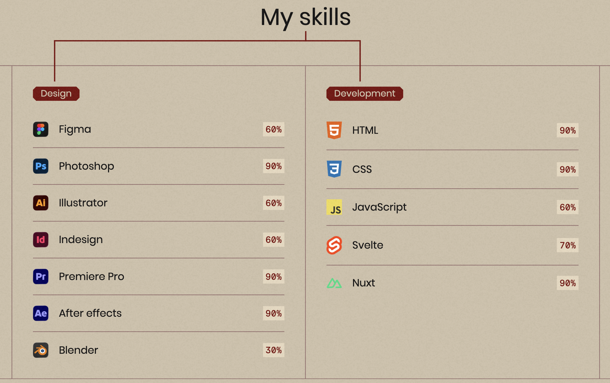 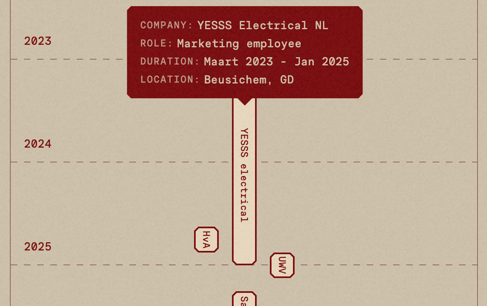

## Herhalende components

Om dubbele code te voorkomen en de website overzichtelijk en uitbreidbaar te houden, heb ik onderdelen die op meerdere pagina’s terugkomen omgezet naar herbruikbare Vue components.

### Breadcrumbs

Om de navigatie simpel te houden, maak ik gebruik van breadcrumbs. Deze keren terug op iedere pagina, met uitzondering van de homepage.

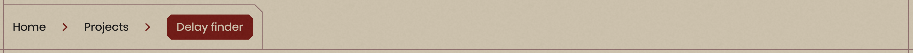

```html
<!-- Breadcrumbs.vue -->
<template>
    <header>
        <nav>
            <slot />
        </nav>
    </header>
</template>
```

Hier maak ik gebruik van een Vue `<slot />`. Een slot is een plek binnen een component waarin een parent component zelf content kan invoegen. Hierdoor kan ik dezelfde structuur en styling van de breadcrumbs hergebruiken, terwijl de inhoud per pagina kan verschillen.

Op iedere pagina vul ik vervolgens zelf de juiste links in:

```html
<!-- Projectpagina -->
<Breadcrumbs>
    <NuxtLink to="/" viewTransition>
        Home
    </NuxtLink>

    <NuxtLink
        :to="`/projects#${project.slug}`"
        viewTransition
    >
        Projects
    </NuxtLink>

    <NuxtLink
        :to="route.path"
        viewTransition
    >
        {{ project.title }}
    </NuxtLink>
</Breadcrumbs>
```

### Header

De header bestaat alleen uit mijn logo. Een klein script houdt bij of de pagina is gescrold. Zodra dit het geval is, wordt de class `is-scrolled` aan de header toegevoegd en wordt het logo kleiner.

Ik heb dit toegevoegd omdat het logo op volledige grootte iets te veel aandacht trok tijdens het scrollen door langere pagina’s.

### Footer

De footer bevat opnieuw alle navigatie-items, aangevuld met links naar LinkedIn en GitHub.

Voor de styling gebruik ik een kleine stip als `background-image`, die zich over de gehele footer herhaalt. Door hier verschillende `linear-gradient` en `radial-gradient` lagen overheen te plaatsen, ontstaat een subtiel patroon met meer diepte.

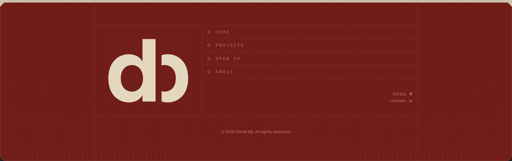

## Nuxt en Vue

Voor de ontwikkeling van de website maak ik gebruik van Nuxt en Vue. Vue zorgt voornamelijk voor de componentstructuur, dynamische data en interacties. Nuxt bouwt hierop voort en regelt onder andere de routing en de structuur van de verschillende pagina’s.

Binnen de website gebruik ik `v-for` om onderdelen vanuit arrays en objecten automatisch te genereren. Dit gebruik ik bijvoorbeeld voor mijn skills, werkervaring en projectkaarten:

```html
<li
    v-for="designSkill in designSkills"
    :key="designSkill.designSkillTitle"
>
    
    <p class="skill-title">
        {{ designSkill.designSkillTitle }}
    </p>
    <p class="percentage">
        {{ designSkill.designSkillPercentage }}
    </p>
</li>
```

Met `v-for` loop ik door de data heen en maak ik voor ieder item automatisch een nieuw HTML-element. De `:key` helpt Vue om ieder item uniek te herkennen en efficiënt bij te werken.

Ook gebruik ik dynamic bindings, zoals `:src`, `:class` en `:style`. Hiermee kan ik HTML properties en CSS-styling koppelen aan data uit JavaScript.

Bij de timeline wordt bijvoorbeeld de positie van ieder onderdeel bepaald vanuit het bijbehorende object:

```html
<span
    v-for="workExperience in workExperiences"
    :key="workExperience.workExperienceId"
    :style="{
        gridRow: workExperience.workExperienceGridRow,
        gridColumn: workExperience.workExperienceGridColumn,
    }"
    @mouseenter="showTooltip(workExperience, $event)"
    @mousemove="moveTooltip($event)"
    @mouseleave="hideTooltip"
>
    {{ workExperience.workExperienceLabel }}
</span>
```

Met event listeners zoals `@mouseenter`, `@mousemove` en `@mouseleave` bestuur ik de interactieve tooltip. De content en positie van de tooltip worden hierbij dynamisch aangepast aan het onderdeel waar de gebruiker overheen hovert.

Voor herbruikbare onderdelen maak ik gebruik van components en slots. Sommige components gebruiken een standaard slot, terwijl andere gebruikmaken van named slots:

```html
<h2>
    <slot name="title" />
</h2>

<p>
    <slot name="content" />
</p>

<p class="usage-warning">
    <slot name="usage-warning" />
</p>
```

Met named slots kan ik per gebruik van een component verschillende soorten content op de juiste plek invoegen. Hierdoor kan dezelfde layout voor meerdere projecten worden gebruikt zonder de volledige HTML-structuur te herhalen.

De projectkaarten worden ook automatisch vanuit de projectdata opgebouwd:

```html
<ProjectCard
    v-for="(project, index) in projects"
    :key="project.id"
    v-bind="project"
    :class="{ remove: shouldRemoveProject(project.tags) }"
/>
```

Met `v-bind="project"` geef ik alle properties uit het projectobject in één keer door aan de `ProjectCard` component. Hierdoor hoef ik niet iedere property handmatig toe te voegen en blijft de code korter en makkelijker uit te breiden.

Voor interne links gebruik ik `NuxtLink`. Dit is de ingebouwde component van Nuxt voor navigatie tussen pagina’s. Hiermee kan de gebruiker naar een andere pagina gaan zonder dat de volledige website opnieuw hoeft te laden.

Op verschillende `NuxtLink` components gebruik ik daarnaast de `viewTransition` property. Hiermee worden overgangen tussen pagina’s gekoppeld aan de View Transitions API, waardoor elementen vloeiender van de ene naar de andere pagina kunnen bewegen.

Door deze features te combineren, kan ik de website grotendeels vanuit herbruikbare data en components opbouwen. Hierdoor blijft het project overzichtelijk en kunnen nieuwe projecten later relatief eenvoudig aan de website worden toegevoegd.

## Responsiveness en optimalisaties

De website is volledig responsive. Ik heb gelet op verschillende schermformaten, mobiele layoutaanpassingen en aanvullende media queries waar deze nodig waren.

Naast media queries op basis van schermbreedte gebruik ik ook queries die controleren welk type invoerapparaat de gebruiker heeft:

```css
@media (hover: hover) and (pointer: fine) {
    .container section:nth-of-type(2) fieldset label:hover {
        opacity: 1;
    }
}
```

### Font-size systeem

Voor de verschillende tekstgroottes maak ik gebruik van CSS custom properties:

```css
:root {
    --h1-size: 1rem;
    --h2-size: 2.25rem;
    --h3-size: 1.33rem;
    --p-size: 1rem;
    --small-size: .875rem;
}

@media (width < 700px) {
    :root {
        --h1-size: .875rem;
        --h2-size: 2rem;
        --h3-size: 1rem;
        --p-size: .875rem;
        --small-size: .8rem;
    }
}
```

Hierdoor kan ik de typography op één centrale plek beheren. Op schermen smaller dan `700px` worden de custom properties aangepast en veranderen alle gekoppelde font sizes automatisch mee.

### Browser support

Tijdens het optimaliseren heb ik de website in verschillende browsers getest. Een aantal moderne CSS properties wordt nog niet door iedere browser ondersteund. Daarom heb ik erop gelet dat de website ook zonder deze properties bruikbaar blijft.

Door de gehele website gebruik ik bijvoorbeeld:

```css
corner-shape: bevel;
```

Deze property zorgt voor de schuine hoekjes op verschillende elementen. Browsers die deze property nog niet ondersteunen, tonen de ingestelde `border-radius` op de normale manier. Het ontwerp ziet er dan iets anders uit, maar blijft wel volledig bruikbaar.

### Firefox-optimalisatie

Op de homepage gebruik ik een SVG-filter om de 3D-objecten een pixeleffect te geven. Deze filter zorgde in Firefox voor merkbaar gestotter.

Om de gebruikservaring te verbeteren, voer ik een browsercheck uit. Wanneer de website in Firefox wordt geopend, voeg ik een class toe waarmee de filter wordt uitgeschakeld:

```css
.pixelate {
    filter: url(#pixelate);
}

.firefox .pixelate {
    filter: none;
}
```

Hierdoor verdwijnt een klein visueel detail, maar blijft de animatie wel soepel werken.

### Media-optimalisatie

Alle afbeeldingen en andere media zijn compressed om de bestandsgrootte en laadtijd van de website te verminderen. Waar mogelijk heb ik daarnaast passende afmetingen en formaten gebruikt, zodat de browser geen onnodig grote bestanden hoeft te laden.

## Terugblik op mijn doelen

Aan het begin van dit project wilde ik een opvallende portfolio website maken waarin ik mijn ontwerp- en developmentvaardigheden kon combineren. Ik wilde geen standaard portfolio bouwen, maar een website die zelf ook als project en statement piece kon functioneren.

Daarnaast wilde ik leren werken met herbruikbare Vue components, Nuxt, View Transitions en verschillende moderne CSS-technieken. Deze technieken heb ik door de hele website heen toegepast. Voorbeelden hiervan zijn de filterbare projectgalerij, de herbruikbare projectdetailpagina’s, named slots, dynamische data, custom properties en CSS properties zoals `interpolate-size`, `corner-shape`, `:has()` & `:target`.

Ook was uitbreidbaarheid een belangrijk doel. De content van mijn projecten staat daarom grotendeels in objecten en wordt met loops en components op de pagina weergegeven. Hierdoor kan ik later nieuwe projecten toevoegen zonder voor ieder project opnieuw de volledige structuur te hoeven bouwen.

Het eindresultaat is een responsive en functionele portfolio website met een eigen visuele stijl. Tegelijkertijd heb ik tijdens het proces meer ervaring opgedaan met het structureren van een groter Nuxt-project en het combineren van experimentele technieken met een bruikbare fallback.
